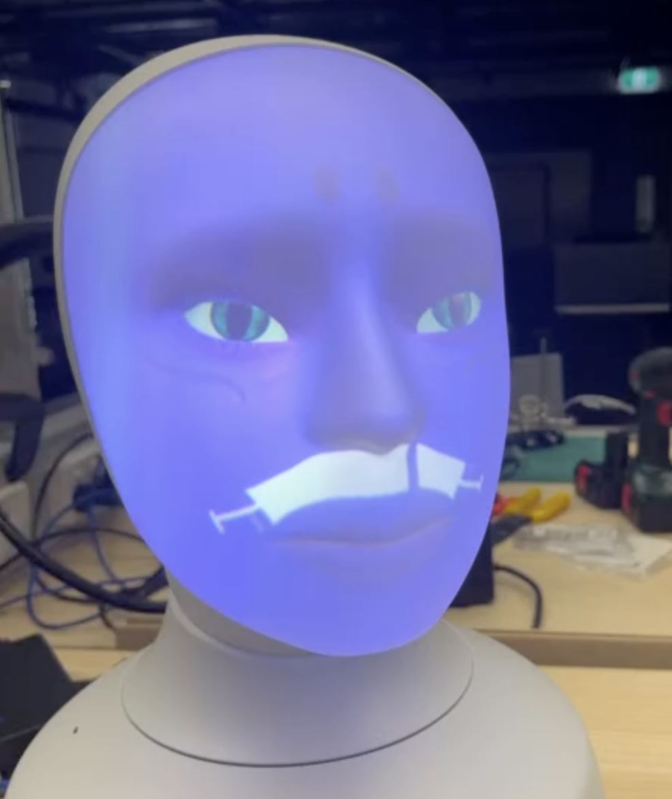

# Furhat Remote API Python Package

[](./resosurces/face.png)


This package serves as a guide for utilizing the Furhat robot's Python application. It facilitates the creation of facial expressions as overlays using new `.png` assets and textures, compiling them into `.charpack` character pack format. Additionally, it includes scripts demonstrating how to play and modify faces programmatically using Python.

## Installation

You can install the package using pip:

```bash
pip install furhat-remote-api
```

## Usage

### `create_charpacks.py`

This script creates character packs for Furhat, which are essentially zipped folders conntaining a description of the face in the form of the JSON string, and all assets which the JSON string refers to.

Overview of steps:
1. Decide which character to overlay additional assets on
2. Copy the designed asset png images into the correct folders (see below)
3. Specify which overlay texture to use in order to generate the new faces
4. Run the Python script and new charpacks will be generated

- **Global Variables**:
  - `BASE_CHAR_NAME`: Name of the character on which additional overlays are added (e.g. `"Emma"`).
  - `NEW_CHAR_NAME`: Name of the new character to be generated (e.g. `"Mel"`).
  - `JSON_SRC`: Path to the source directory containing the JSON string descriptions for all the characters' faces, fixed to `"json_src"`.
  - `TEXTURE_SRC`: Path to the source directory containing the png files of all the flattened character faces, fixed to `"plot_src/"+NEW_CHAR_NAME`.
  - `TEXTURE_TYPE`: Type of texture being used (e.g. `"facial-hair"`), note that this has to be selected from the list of available overlay names.
  - `TEXTURE_NAME`: Name of the texture (e.g. `"plot"`).
  - `OVERLAY_NAMES`: A list of available overlay names (note that this list might not be exhaustive).

- **Folders**:
  - `charpacks/`: Destination folder where the new generated charpack files will be located.
  - `json_lookup_folder/`: Folder containing **FORMATTED** JSON strings describing each of the character faces. These should only be for the user to inspect the descriptions of each of the character faces.
  - `json_src/`: Folder containing **RAW** JSON strings (as obtained from the Furhat SDK Desktop Launcher's system files in the laptop) describing each of the character faces. These are needed as it is very likely that the Furhat engine reads the JSON descriptions as single-line `.txt` files.
  - `models/`: Folder where all the files required to generate a charpack (including face JSON strings and the referenced asset files) will be staged. Note that the naming and structure of the subfolders must be like this, in order for the Furhat to load it properly when the charpack is uploaded to the robot and run.
  - `models_src/`: Folder where 
  - `plot_src/`: Folder which stores the overlay `.png` files. Within this folder, there should be subfolders, each with the same name as the specified `"NEW_CHAR_NAME"` variable. Note that the specific naming of the overlay `.png` files can be arbitrary.

- **Functionality**:
  - Copies the source folder to a new folder.
  - Renames and moves images to a designated folder for textures.
  - Updates JSON files with new texture references.
  - Packages the characters into a `.charpack` file.

### `play_faces.py`

This script demonstrates how to play faces, aka change the face after a some time (defined as a paramrter) on Furhat to create animations

- **Global Variables and Paths**:
  - IP address (`10.100.237.184`) or `localhost` for the Furhat robot or SDK.
  
- **Functionality**:
  - Connects to the Furhat robot or SDK using the provided IP address.
  - Retrieves available voices and sets a voice for the robot.
  - Loads a specific face (character) and performs actions like speaking, gestures, and transitioning between different facial expressions.

Remember to replace placeholder variables, such as IP addresses, file paths, and character names, with your specific configurations. These scripts offer an interface to interact with Furhat robot functionalities through Python, enabling users to create and control various facial expressions and actions programmatically.

Refer to the code comments and documentation within the repository for detailed guidance on each script's functionality, inputs, and expected outputs.
